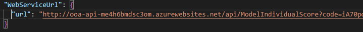
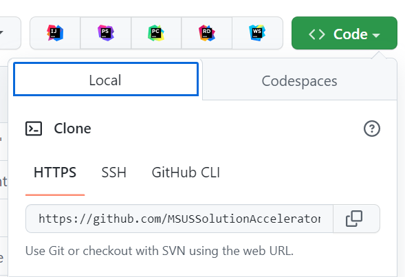

# Overdose Prevention Accelerator

## Prerequisites

To use this Accelerator, you will need access to and/or provision the following applications:

1. Access to an Azure Subscription
1. Visual Studio Code
1. VS Code Bicep Extension (<https://marketplace.visualstudio.com/items?itemName=ms-vscode.vscode-bicep>)

A working knowledge of Azure, Azure Storage Accounts, Azure Functions, will also be helpful. To learn more about these services, please visit:

1. Azure
1. Azure Storage Accounts
1. Azure Functions
1. Azure App Services

For users who wish to select features and adjust the model in the cloud, a working knowledge of Azure Databricks would be helpful.

## Step 1. Download Files

To start, fork this repository and clone it to your local machine. You will be making changes locally that will be pushed back to the Github repository.

## Step 2. Setup Resources

### Deploy the resource group and function app to the resource group

  Use the resource group you select or create for all resources in this deployment.  An example name would be "{your-name}-OOA-rg".

  If prompted, select Python 3.9 as the runtime.

  [](https://portal.azure.com/#create/Microsoft.Template/uri/https%3A%2F%2Fraw.githubusercontent.com%2FMSUSSolutionAccelerators%2FOverdose-Prevention-Solution-Accelerator%2Fmain%2FfunctionApp.json)

### Upload data to be used by the function app

  To upload the data used for the solution, follow these steps:

  1. Open the Data Lake (look in the resource group you used during the previous step for a resource with the name 'ooads{uniqueString}')
  1. Click the tab on the left column menu called Storage browser
  1. Click on the Blob containers square
  1. Click Add container, type in a name, and click Create
  1. Click Upload and upload these files to the newly created container:
      - Individual-Risk-Profile/models/calibXGB.model
      - Individual-Risk-Profile/models/colNamesList.zip
      - Individual-Risk-Profile/models/modelXGBCal.explainer
      - Individual-Risk-Profile/models/modelXGBCalPredProbs.npy

<!-- Skip for now.  We are not deploying a Key Vault in the ARM template -->
### Configure Key Vault (optional)

  For first time deployment, skip this step and continue with the next section: **Function App Configuration**.
  
  This is an optional step.  If you want to use a key vault, you will need to deploy one yourself, as it is notcurrently deployed as part of the initial template.

  To configure the Key Vault, follow these steps:

  1. In the Data Lake (called 'ooads{uniqueString}'), click the tab on the left column menu called Access keys
  1. Click the Show button next to the Key value for key1, and copy that value
  1. Open the Key Vault (called 'ooakv{uniqueString}' in this deployment package)
  1. Click the tab on the let column menu called Secrets
  1. Click Generate/Import Secret
  1. Enter a Name for the secret and enter the copied key1 in the Value field, then click Create

### Function App Configuration

  To ensure the Function App is able to access data and return predictions, follow these steps:
  
  1. Open the file `OOA-Function-App/ModelIndividualScore/__init__.py` in VS Code
  1. Set `abs_acct_name` on line 23 as the name of the storage account in the resource group
  1. Set `abs_container_name` on line 25 as the name of the container the model data is placed in
  1. If using a Key Vault, set `key_vault_name` on line 30 as the name Key Vault in the resource group and set `blob_secret_name` on line 32 as the name of the secret.
  1. If not using a Key Vault, set `connection_string` on line 49 as the connection string for the storage account in the resource group.  This can be found in the Azure portal by going back to the Access Keys page of the Storage account resource. The connection string is in the form of: `DefaultEndpointsProtocol=https;AccountName=<storageAccountName>;AccountKey=<storageAccountKey>;EndpointSuffix=core.windows.net`
  1. Make sure all changes have been saved (Ctrl+S is the shortcut to save in VS Code)
  1. Click the Azure icon on the left-hand menu in VS Code
  1. Hover over WORKSPACE, and click the cloud icon with an up arrow that appears, then click Deploy to Function App
  1. Select the Subscription and Resource Group the Function App is deployed in, then select that Function App
  1. Click Deploy on the pop-up window that appears; this will deploy the Function App

### Configure the Front End Web App for connecting to the function app

To ensure the Web App can connect to the Function App in this solution, follow these steps:

  1. Open the Function App in the Azure portal (look for the function app in the resource group you created)
  1. Click the tab on the left column menu called Functions
  1. Click on the function named 'ModelIndividualScore'
  1. Click the button up top called 'Get Function Url'
  1. Copy the URL to the clipboard
  1. Add that URL to the file `Overdose-Accelerator-Web\appsettings.json` under the `WebServiceUrl` section. This is the URL that the Web App will use to connect to the Function App.  The result will look like this:   

### Front end web app configuration
  
Ensure your Github repo is public

### Update the url for the Deploy Button to point to your forked repository

1. Update the `repoURL` param in the file `dotnetApp.bicep` file to point to your Github repository.  You can get the url for the repo by clicking the Code drop down on the main page of the Github repository.  
  
1. Build the bicep file by opening the terminal in VS Code and running:
`az bicep build --file dotnetApp.bicep --outdir .`
1. The previous command updates the file 'dotnetApp.json', which is used by the Deploy to Azure button in the next step.

### Generate the new string

1. Navigate to the `dotnetApp.json` file in your cloned repository
1. Retrieve the URL by selecting 'Raw' and copying the url from your browser's address bar.  

1. The format of the URL is: `https://raw.githubusercontent.com/MSUSSolutionAccelerators/Overdose-Prevention-Solution-Accelerator/main/dotnetApp.json`
1. Encode the URL by using the powershell script below (replace the url with the url you copied from your browser's address bar)):

```powershell
$url = "<Replace this with your forked repo's dotnetApp.json raw URL>"
[uri]::EscapeDataString($url)
```

Example:
A forked repo's dotnetApp.json file url might look like: `https://raw.githubusercontent.com/nsmaassel/Overdose-Prevention-Solution-Accelerator/deploy/dotnetApp.json`

Then you'd run the command:

```powershell
$url = "https://raw.githubusercontent.com/nsmaassel/Overdose-Prevention-Solution-Accelerator/deploy/dotnetApp.json"
[uri]::EscapeDataString($url)
```

It would give this encoded url as its output: `https%3A%2F%2Fraw.githubusercontent.com%2Fnsmaassel%2FOverdose-Prevention-Solution-Accelerator%2Fmain%2FdotnetApp.json`

You'd then use that encoded url in the Deploy to Azure button in the next step.

### Update the Deploy to Azure button's url

1. Copy the output.  It will have replaced the url with a string that can be used in the Deploy to Azure button.
1. Edit this file (README.md) and replace the string `<URL_ENCODED_STRING_TO_DOTNETAPP_JSON>` with the encoded URL. The result will look like this: `https://portal.azure.com/#create/Microsoft.Template/uri/https%3A%2F%2Fraw.githubusercontent.com%2FMSUSSolutionAccelerators%2FOverdose-Prevention-Solution-Accelerator%2Fdeploy%2FdotnetApp.json`
1. Commit and push your changes to Github
1. Continue to the next step by clicking the Deploy to Azure button

1. Deploy the frontend app. When prompted for a resource group, select the resource group you created in the first step:

[](https://portal.azure.com/#create/Microsoft.Template/uri/<URL_ENCODED_STRING_TO_DOTNETAPP_JSON>)

  Note - Whenever the .bicep files are modified, the main.json file needs to be updated by running:

`az bicep build --file dotnetApp.bicep --outdir .`

## Congratulations

You have completed this solution accelerator and should now have a report to explore the personalized recommendations.

# Opioid Overdose Accelerator

## About This Repository

The Opioid Overdose Solution Accelerator is an end-to-end solution that provides a risk score that a patient will overdose on opioids in the next year that medical providers can take into account when making clinical decisions and an overview of opioid overdoses at the community level.

The individual risk score tool allows for medical providers to input a set of demographic and medical data for an individual patient, which will return the risk score for an individual overdosing on opioids in the next year, along with the percentile of that risk score. It will also return the 5 features that are most likely to increase an individual's risk of overdosing on opioids. This information is only meant to be used in conjunction with other aspects of a patient's medical history and should not be used as the sole factor in deciding whether or not to prescribe opioids.

The community level map allows for interested community members to map the number of opioid overdoses in a certain area as well as the concentration of schools, clinics, hospitals, social facilities, fire stations, police stations, and libraries. The example geography used in the community level map is King County, WA at the ZIP Code level.

Users of this Solution Accelerator will be able to customize both the patient charesteristics for the individual risk score module and the geographic features & community institutions for the map view.

## Architecture Overview

The architecture diagram below details what will be built with this Solution Accelerator.


# Getting started with the data model

## Individual Risk Score Model

The Individual Risk Score model generates the probability that an individual will overdose on opioids within the next year and the percentile of the population their overdose risk falls in.

### Features

The features for the Individual Risk Score Model come from the National Survey on Drug Use and Health (NSDUH). The survey includes over 2,000 features selected from around 30,000 participants each year. A full list of features can be found in the NSDUH Codebook.

For this Solution Accelerator, 27 features were used, relating to demographics, substance use, and mental health. The features are split into 5 categories, as detailed below:

#### Section 1: Personal Info

| Survey Code | Feature | Type |
| --- | --- | --- |
| EDUHIGHCAT | Educational Attainment | Categorical |
| AGE2 | Age | Bin |
| IRSEX | Sex | Categorical |
| TXYRRECVD2 | Substance Use Treatment in Past Year | Binary |
| TXEVRRCVD2 | Substance Use Treatment in Lifetime | Binary |

#### Section 2: Alcohol History

| Survey Code | Feature | Type |
| --- | --- | --- |
| IRALCAGE | Age at First Use of Alcohol | Bin |
| IRALCRC | Most Recent Alcohol Use | Categorical |
| IRALCFY | Days Using Alcohol in Past Year | Bin |
| CABINGEVR | Ever Binge Drank | Categorical |

#### Section 3: Smoking History (Tobacco & Cannabis)

| Survey Code | Feature | Type |
| --- | --- | --- |
| IRCIGRC | Most Recent Cigarette Use | Categorical |
| CIGAGE | Age When Daily Cigarette Use Started | Bin |
| FUCIG18 | First Ever Cigaretts Use before Age 18 | Categorical |
| TOBYR | Tobacco Use in Past Year | Categorical |
| IRMJRC | Most Recent Cannabis Use | Categorical |
| IRMJFY | Days Using Cannabis in Past Year | Bin |
| FUMJ18 | First Ever Cannabis Use before Age 18 | Categorical |

#### Section 4: Hard Drug History

| Survey Code | Feature | Type |
| --- | --- | --- |
| IRCOCRC | Most Recent Powder Cocaine Use | Categorical |
| IRCRKRC | Most Recent Crack Cocaine Use | Categorical |
| IRHERRC | Most Recent Heroin Use | Categorical |
| IRHALLUCREC | Most Recent Hallucinogen Use | Categorical |
| IRLSDRC | Most Recent LSD Use | Categorical |
| IRECSTMOREC | Most Recent Ecstasy Use | Categorical |
| IRINHALREC | Most Recent Inhalent Use | Categorical |
| IRMETHAMREC | Most Recent Amphetamnic Use | Categorical |

#### Section 5: Mental Health & Criminal Justice

| Survey Code | Feature | Type |
| --- | --- | --- |
| ADDPREV | Feeling Depressed for Several Days | Binary |
| ADDSCEV | Feeling Discouraged for Several Days | Binary |
| BOOKED | Booked in Criminal Justice System | Binary |

The target variable `MISUSE` was coded from values of the survey code `PNRNMREC` that signify an overdose on opioids in the past year.

### Model

The model that was selected for the implementation of this Solution Accelerator is a calibrated Extreme Gradient Boosting (XGBoost) model. The hyperparameters of the model are as follows:

| Hyperparameter | Value |
| --- | --- |
| `learning_rate` | 0.1 |
| `max_depth` | 3 |
| `n_estimators` | 630 |
| `booster` | gbtree |

### Function App

When users of the Individual Risk Score Model Web App submit their inputs to be modelled, those inputs are sent to the Function App as an HTTP POST method over its API. There, the incoming JSON is converted to a Pandas DataFrame, and inputs values are adjusted to align with the same values as in the NSDUH training data. For example, the values for Days Using Alcohol in the Past Year differ based on if a respondant has never drank alcohol or has not drank alcohol in the past year.

The inputs are then run against the model, and the risk probability, percentile, and features with SHAP values are returned. These are then combined into a JSON object, which is sent back to the Web App.

## Community Rate Visualization

The Community Rate Visualization allows for interested community members to view the number of opioid overdoses in geographic regions (in this example, ZIP Codes in King County, WA) and the location of community institutions to see if the locations of these institution correlate with a higher or lower overdose rate.

For this Solution Accelerator, the number of overdoses in each ZIP Code in King County was imputed based on the number of fatal overdoses in a ZIP Code. Comparing the number of fatal and non-fatal opioid overdoses showed that around 12.50% of opioid overdoses were fatal, so the total number of overdoses was imputed by taking the number of fatal overdoses and dividing them by 0.1250. The number of overdoses were then added to as properties of GeoJSON files containing all ZIP Codes within King County.

The community institutions were pulled from, and cached on the Web App server from the OpenStreetMap API. The community institutions chosed for this Solution Accelerator are schools, clinics, hospitals, social facilities, fire stations, police stations, and libraries.

The overdose data, geographies, and categories of community institutions can be modified to allow for users to customize the data displayed to their specific needs.

## License

Copyright (c) Microsoft Corporation

All rights reserved.

MIT License

Permission is hereby granted, free of charge, to any person obtaining a copy of this software and associated documentation files (the ""Software""), to deal in the Software without restriction, including without limitation the rights to use, copy, modify, merge, publish, distribute, sublicense, and/or sell copies of the Software, and to permit persons to whom the Software is furnished to do so, subject to the following conditions:

The above copyright notice and this permission notice shall be included in all copies or substantial portions of the Software.

THE SOFTWARE IS PROVIDED AS IS, WITHOUT WARRANTY OF ANY KIND, EXPRESS OR IMPLIED, INCLUDING BUT NOT LIMITED TO THE WARRANTIES OF MERCHANTABILITY, FITNESS FOR A PARTICULAR PURPOSE AND NONINFRINGEMENT. IN NO EVENT SHALL THE AUTHORS OR COPYRIGHT HOLDERS BE LIABLE FOR ANY CLAIM, DAMAGES OR OTHER LIABILITY, WHETHER IN AN ACTION OF CONTRACT, TORT OR OTHERWISE, ARISING FROM, OUT OF OR IN CONNECTION WITH THE SOFTWARE OR THE USE OR OTHER DEALINGS IN THE SOFTWARE

## Contributing

This project welcomes contributions and suggestions.  Most contributions require you to agree to a
Contributor License Agreement (CLA) declaring that you have the right to, and actually do, grant us
the rights to use your contribution. For details, visit <https://cla.opensource.microsoft.com>.

When you submit a pull request, a CLA bot will automatically determine whether you need to provide
a CLA and decorate the PR appropriately (e.g., status check, comment). Simply follow the instructions
provided by the bot. You will only need to do this once across all repos using our CLA.

This project has adopted the [Microsoft Open Source Code of Conduct](https://opensource.microsoft.com/codeofconduct/).
For more information see the [Code of Conduct FAQ](https://opensource.microsoft.com/codeofconduct/faq/) or
contact [opencode@microsoft.com](mailto:opencode@microsoft.com) with any additional questions or comments.

## Trademarks

This project may contain trademarks or logos for projects, products, or services. Authorized use of Microsoft
trademarks or logos is subject to and must follow
[Microsoft's Trademark & Brand Guidelines](https://www.microsoft.com/en-us/legal/intellectualproperty/trademarks/usage/general).
Use of Microsoft trademarks or logos in modified versions of this project must not cause confusion or imply Microsoft sponsorship.
Any use of third-party trademarks or logos are subject to those third-party's policies.
